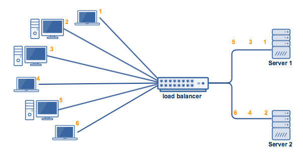
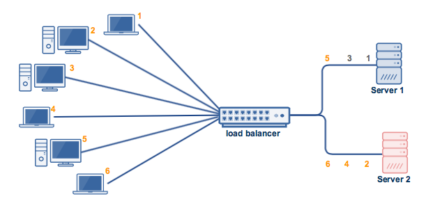

## Soal 2

### Deskripsi Soal:
2. Analisa apa perbedaan antara ketiga algoritma tersebut.

#### Round-Robin

Sebagai contoh, kita memiliki dua server di belakang load balancer. Ketika request pertama diterima, load balancer akan meneruskan request tersebut ke server pertama. Selanjutnya ketika request kedua diterima, load balancer akan meneruskan ke server kedua. Request akan diteruskan secara siklus.

Algoritma Round-Robin bekerja secara mudah, namun performanya tidak akan selalu baik pada skenario tertentu. Sebagai contoh, server pertama memiliki spesifikasi lebih tinggi dibandingkan dengan server kedua, server pertama seharusnya bisa menangani request lebih banyak dibandingkan server kedua. Dengan algoritma ini, load balancer tidak akan mempedulikannya dan tetap membagi request secara adil. Hal ini bisa saja menyebabkan server kedua overload hingga down.

Algoritma Round-Robin baik digunakan pada kluster yang memiliki server dengan spesifikasi yang sama.

#### Least Connections

Ada saatnya meskipun kedua server memiliki spesifikasi yang sama, salah satunya akan mengalami overload lebih cepat dibandingkan yang lain. Hal ini bisa saja disebabkan klien yang terhubung dengan suatu server tetap terhubung dalam jangka waktu yang lama dibandingkan dengan klien yang terhubung dengan server lainnya.

Hal ini menyebabkan total beban di suatu server akan terus bertambah hingga overload. Contoh pada gambar menunjukkan klien 1 dan 3 yang sudah tidak terhubung lagi dengan server pertama, sedangkan klien yang terhubung dengan server kedua masih tetap terhubung.

Pada skenario seperti ini, Algoritma Least Connections adalah algoritma yang cocok untuk digunakan. Algoritma ini akan mempertimbangkan banyak koneksi yang dimiliki oleh tiap server. Ketika klien mencoba terhubung, load balancer akan mencari server mana yang memiliki total koneksi paling sedikit dibanding yang lain dan akan meneruskan request dari klien ke server tersebut.

### IP Hash
Algoritma ini membagi beban kerja server berdasarkan alamat IP klien. Ketika klien memiliki alamat IPv6 maka perhitungan hash didapatkan dari keseluruhan alamat. Ketika klien memiliki alamat IPv4 maka perhitungan hash didapatkan dari tiga oktet pertama dari alamat klien.

Algoritma IP Hash ini dirancang untuk mengoptimalkan klien ISP yang diberi alamat IP secara dinamis dalam subnet /24. Jika terjadi reboot atau rekoneksi, alamat klien berubah tetapi masih dalam subnet yang sama, koneksinya pun masih merepresentasikan klien yang sama, jadi tidak ada alasan untuk mengubah pemetaan ke server.
